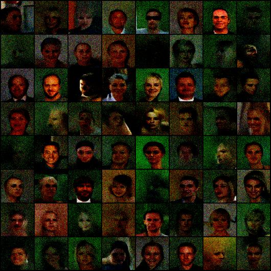

Rrepository created for a project for the course "Probabilistic graphical models" from MVA master.

The main file to run the code is denoiser_basic.py . The NCSN architecture is stored in Unet.py and weights were saved from our last attempts (  denoisercelebab.pt for CELEBA 64x64 and denoisercifar.pt for CIFAR10 ). The script could be run on test mode ( using the saved weights ) or training mode ( new weights calculated ).
to run in train mode :

python3 denoiser_basic.py --dataset CELEBA

to run in test mode : 

python3 denoiser_basic.py --dataset CELEBA --test ./denoisercelebab.pt

it should generate images like this :

Some additional notebooks contain our other experiments : 
- ddpm-from-scratch.ipynb is a notebook that implements DDPM in Pytorch ( a public notebook found on Kaggle we used and made some experiments on )
- toy_langevin_dynamics.ipynb is a notebook that tests score matching ( through an MLP + annealed langevin dynamics ) ( code inspired from : https://github.com/JeongJiHeon/ScoreDiffusionModel/tree/main/NCSN )
